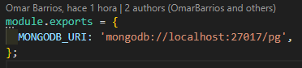
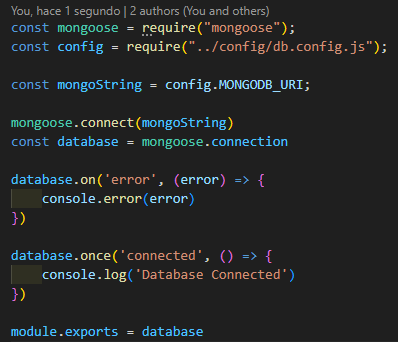
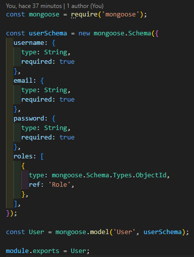
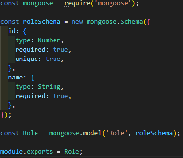
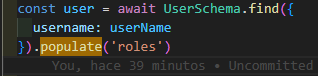
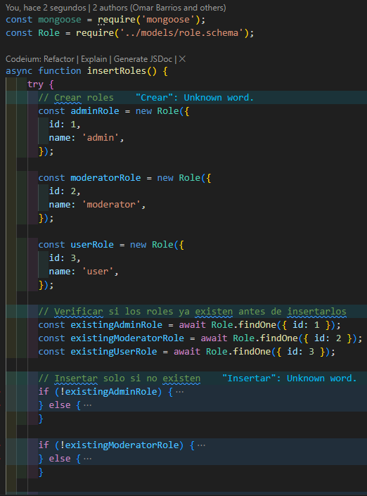
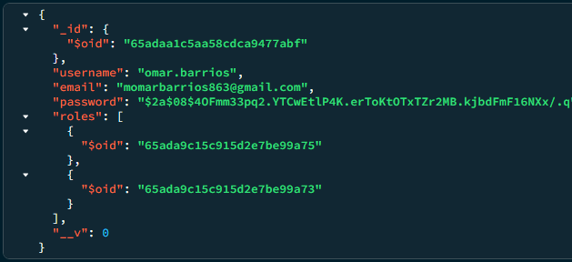
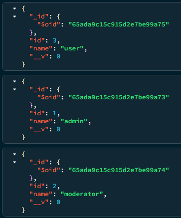
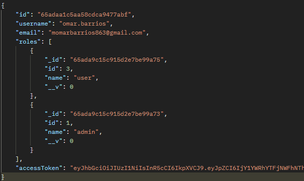

# Cambio de base de datos Mysql a MongoDB

## Paso 1:
```
Agregar una variable de entorno:
```



## Paso 2:
```
Crear un script donde está la conexión a la base de datos con el ORM mongoose:
```



## Paso 3:
```
Luego crear los esquemas para las colecciones que se necesitan (users, roles)
Aquí se define la relación entre las colecciones (esquema de user) para que devuelva los datos de cada rol se usa la función populate de mongoose.
```
| User  | Role |
| ------ | ------- |
|  |  |




## Paso 4:
```
Una vez ya existan los esquemas podemos crear el seeder para los roles:
```



## Paso 5:
```
Estos son los objetos ya insertados en la base de datos:
```
| User  | Role |
| ------ | ------- |
|  |  |

## Paso 6:
```
Por último nos logueamos con el usuario registrado y esta es la respuesta de la API:
```

